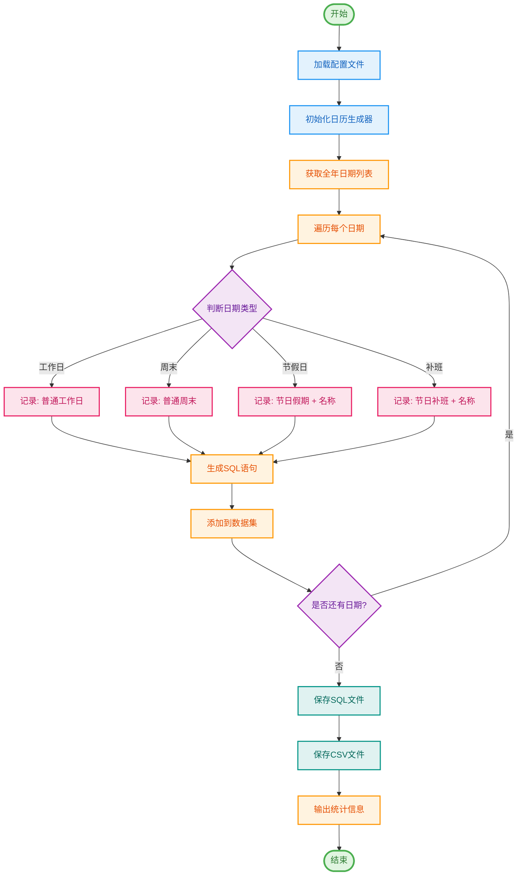

## 中国农历假期生成

使用场景： 根据中国的节假日表，自动生成Oracle工作日历插入报表。

操作：
- 因为需要同步最新的法定节假日库，所以需要移动`main.py`内部代码到公网环境。
- 更新`chinese_calendar`依赖库（使用`pip install -U chinesecalendar`命令进行更新。
- 填充`main.py`头部的参数地址并运行`main.py`即可生成Oracle的insert脚本。

## 示例运行
执行该脚本后，将在指定路径下生成 `.sql` 和 `.csv` 文件，分别包含 SQL 语句和数据统计表格。

## 配置
- `TARGET_TABLE`: 目标数据库表名。
- `TARGET_YEAR`: 生成数据的目标年份。
- `TARGET_SAVE_PATH`: 生成文件的保存路径。

## 执行流程
1. 创建必要的文件夹结构。
2. 获取目标年份的所有日期。
3. 对每个日期执行判断，并根据结果生成相应的 SQL 语句。
4. 将 SQL 语句写入文件，并将 DataFrame 数据输出为 CSV 文件。



## 项目结构

```
cn-holiday-sqlgen/
├── config.yaml          # 配置文件
├── main.py             # 主程序
├── requirements.txt    # 依赖列表
├── README.md          # 说明文档
└── work_calendar/     # 输出目录（自动创建）
    ├── 2024Day.sql    # SQL文件
    └── 2024Day.csv    # CSV文件
```

## 代码架构

项目采用面向对象设计，主要包含以下类：

- `ConfigLoader`: 配置加载器，负责读取和解析YAML配置
- `DateTypeJudge`: 日期类型判断器，判断日期属于哪种类型
- `CalendarGenerator`: 日历生成器，协调整个生成流程
- `Config`: 配置数据类
- `DateTypeConfig`: 日期类型配置数据类

## 注意事项

⚠️ **重要提示**：

1. **网络环境要求**：程序需要在公网环境运行，以便同步最新的法定节假日数据
2. **依赖库更新**：建议定期更新 `chinesecalendar` 库以获取最新数据
   ```bash
   pip install -U chinesecalendar
   ```
3. **数据可用性**：次年的节假日安排取决于国务院发布的日程，通常在每年 **11月前后** 发布新版本
   - 例如：2025年的数据需要在2024年11月以后才能获取

## 更新日志

### v2.0 (2025-11-04)
- ✨ 重构代码，符合PEP8规范
- ✨ 引入YAML配置文件
- ✨ 采用面向对象设计
- ✨ 添加完善的日志系统
- ✨ 使用dataclass简化配置管理
- ✨ 改进错误处理机制
- 📝 更新文档

### v1.0 (2024-07-26)
- 🎉 初始版本发布

## 许可证

本项目采用 MIT 许可证。详见 [LICENSE](LICENSE) 文件。

## 贡献

欢迎提交 Issue 和 Pull Request！

## 作者

- **Mintimate**
- 创建日期：2024-07-26